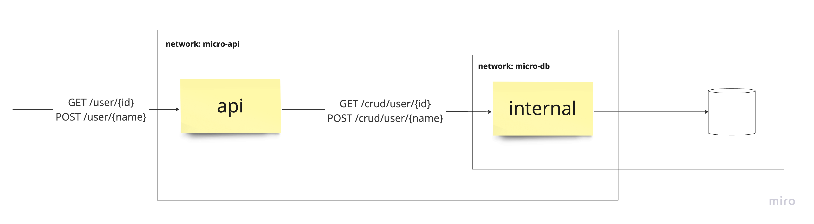
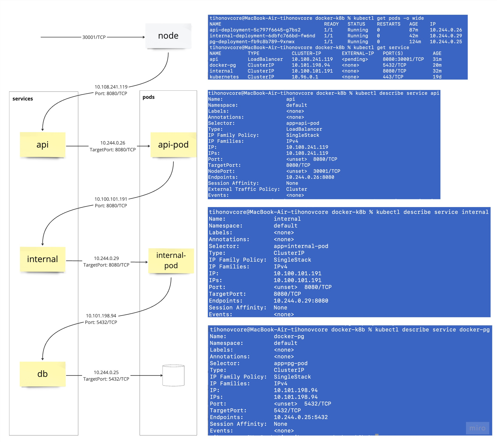

### Architecture



### Docker

`docker build --tag api:v1.0 ./api`

`docker build --tag internal:v1.0 ./internal`

`docker run --rm -p 8080:8080 -v m2:/root/.m2 --network micro-api --name api api:v1.0`

`docker run --rm -v m2:/root/.m2 --network micro-api -e PG_USERNAME=postgres -e PG_PASSWORD=123 --name internal internal:v1.0`

`docker pull postgres`

`docker run --rm -e POSTGRES_PASSWORD=123 -v pg:/var/lib/postgresql/data --name docker-pg --network micro-db postgres`

```roomsql
create table users(id SERIAL, name text);
```

`docker network connect micro-db c9b52e69f5c9`
c9b52e69f5c9 - имя контейнера internal

`curl --location --request POST 'localhost:8080/user?name=bar'`

`curl --location --request GET  'localhost:8080/user/1'`

`docker rmi api:v1.0`

`docker rmi internal:v1.0`

`docker volume rm m2`

`docker volume rm ps`

### Docker compose

`docker compose up`

### Minikube

`minikube start`

`minikube dashboard` - UI куба

`eval $(minikube -p minikube docker-env)` - для использования локальных images

`kubectl create secret generic pg-secret`\
`kubectl apply -f pg-secret.yaml`\
`kubectl get secret/pg-secret -o yaml` - получить описание в yaml

`kubectl apply -f pg-deployment.yaml`\
`kubectl apply -f internal-deployment.yaml`\
`kubectl apply -f api-deployment.yaml`

`minikube service api`, где api - имя сервиса из api-deployment, для открытия порта снаружи в minikube 



# Resource quotas

`docker build --tag greedy:v1.0 ./greedy`

* `GREEDY_MODE=CPU` - проверяет натуральные числа на простоту
* `GREEDY_MODE=MEM` - наполняет список случайными строками

`kubectl apply -f greedy-deployment.yaml`

`kubectl top pod greedy-deployment-546b45d5bf-ngv58` - Display Resource (CPU/Memory) usage

# Jobs

`docker build --tag job:v1.0 ./job`

`kubectl apply -f job.yaml`\
`kubectl delete job hello-job`

`kubectl apply -f cronjob.yaml`\
`kubectl delete cronjob hello-cron-job`

прибить джобу если работает дольше `activeDeadlineSeconds` секунд\
удалить данные о джобе спустя `ttlSecondsAfterFinished` секунд после завершения\
`completions` - число запусков джобы\
`parallelism` - число одновременно работающих запусков\
`completionMode` - если `Indexed`, то джобам назначаются индексы, можно достать из JOB_COMPLETION_INDEX\
`backoffLimit` - максимальное число ретраев суммарно по всем джобам\
остановить ретраи индекса после `backoffLimitPerIndex` (с v1.29) попыток\
остановить все ретраи после падения `maxFailedIndexes` индексов

# Volume

`kubectl apply -f volume.yaml`

`kubectl apply -f pg-claim.yaml`

`kubectl apply -f pg-deployment.yaml`

# ConfigMap

Можно добавить через volume как файл и сослаться на него при запуске приложения

# Неймспейсы

`kubectl create namespace api-namespace`

`kubectl create namespace db-namespace`

Везде прописываем metadata.namespace
